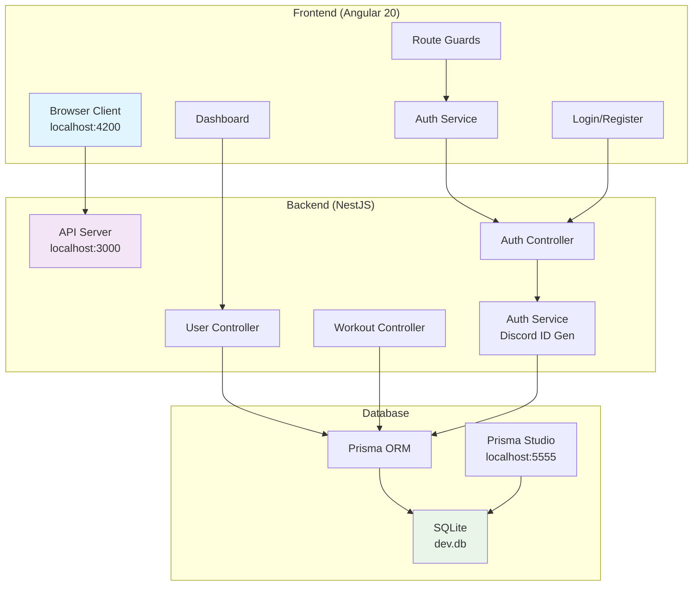
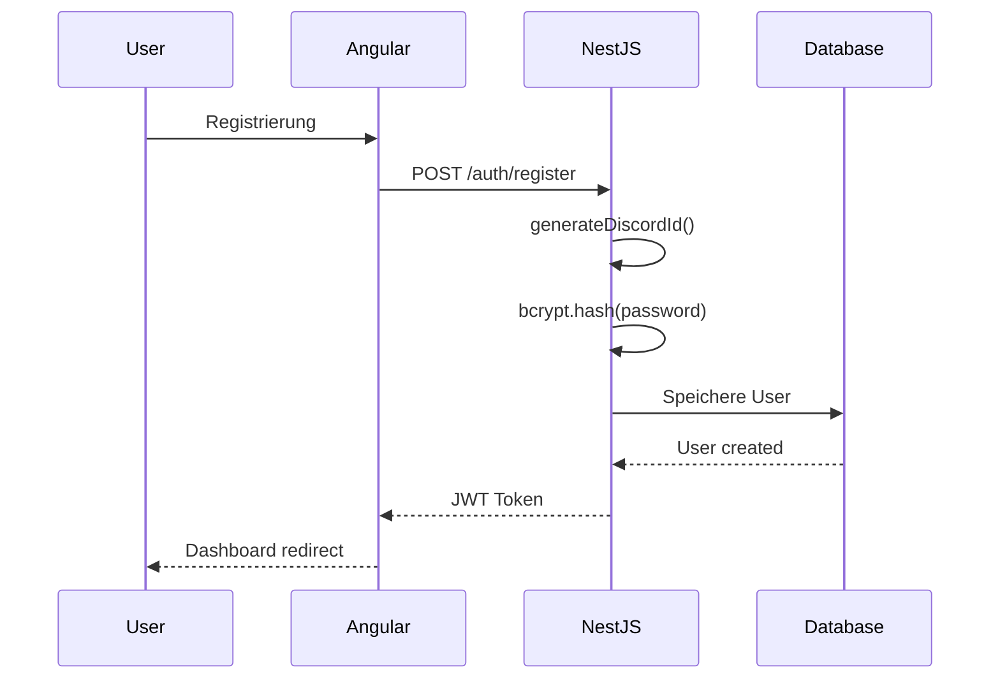
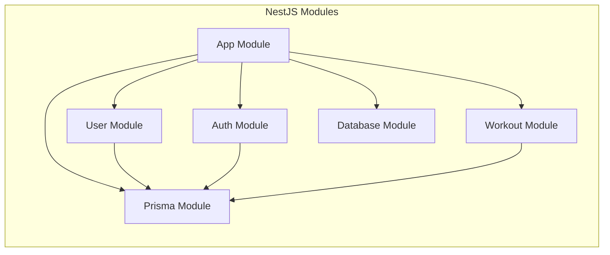
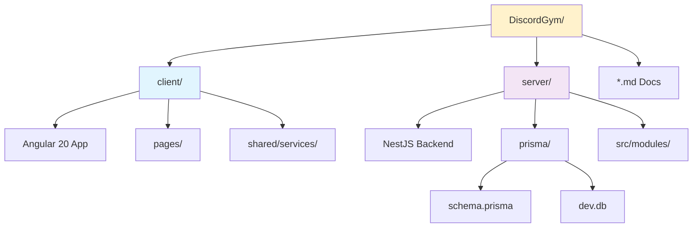

# 🏗️ DiscordGym - System Architektur

## 📊 Übersicht der Anwendungsarchitektur

```mermaid
graph TB
    subgraph "Frontend (Angular 20)"
        A[Browser Client<br/>localhost:4200]
        B[Auth Service]
        C[Dashboard]
        D[Login/Register]
        E[Route Guards]
    end
    
    subgraph "Backend (NestJS)"
        F[API Server<br/>localhost:3000]
        G[Auth Controller]
        H[User Controller]
        I[Workout Controller]
        J[Auth Service<br/>Discord ID Gen]
    end
    
    subgraph "Database"
        K[SQLite<br/>dev.db]
        L[Prisma ORM]
        M[Prisma Studio<br/>localhost:5555]
    end
    
    A --> F
    B --> G
    C --> H
    D --> G
    E --> B
    G --> J
    H --> L
    I --> L
    J --> L
    L --> K
    M --> K
    
    style A fill:#e1f5fe
    style F fill:#f3e5f5
    style K fill:#e8f5e8
```

## 🔐 Authentifizierung Flow

```mermaid
sequenceDiagram
    participant User
    participant Angular
    participant NestJS
    participant Database
    
    User->>Angular: Registrierung
    Angular->>NestJS: POST /auth/register
    NestJS->>NestJS: generateDiscordId()
    NestJS->>NestJS: bcrypt.hash(password)
    NestJS->>Database: Speichere User
    Database-->>NestJS: User created
    NestJS-->>Angular: JWT Token
    Angular-->>User: Dashboard redirect
```

## 🗂️ Module Struktur

```mermaid
graph LR
    subgraph "NestJS Modules"
        AM[App Module]
        PM[Prisma Module]
        UM[User Module]
        AUM[Auth Module]
        WM[Workout Module]
        DM[Database Module]
    end
    
    AM --> PM
    AM --> UM
    AM --> AUM
    AM --> WM
    AM --> DM
    
    UM --> PM
    AUM --> PM
    WM --> PM
```

## 📁 Folder Struktur

```mermaid
graph TD
    Root[DiscordGym/]
    Root --> Client[client/]
    Root --> Server[server/]
    Root --> Docs[*.md Docs]
    
    Client --> Angular[Angular 20 App]
    Client --> Pages[pages/]
    Client --> Services[shared/services/]
    
    Server --> NestJS[NestJS Backend]
    Server --> Prisma[prisma/]
    Server --> Modules[src/modules/]
    
    Prisma --> Schema[schema.prisma]
    Prisma --> DB[dev.db]
    
    style Root fill:#fff2cc
    style Client fill:#e1f5fe
    style Server fill:#f3e5f5
```
