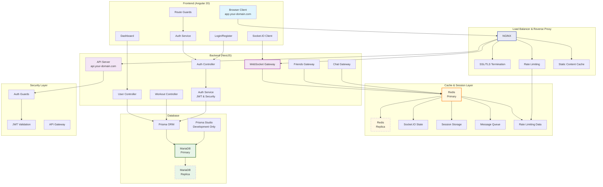
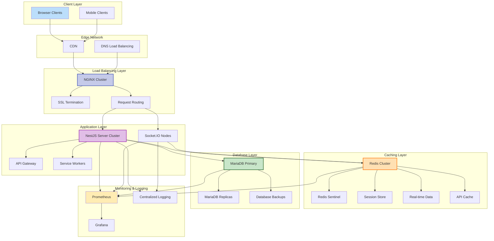
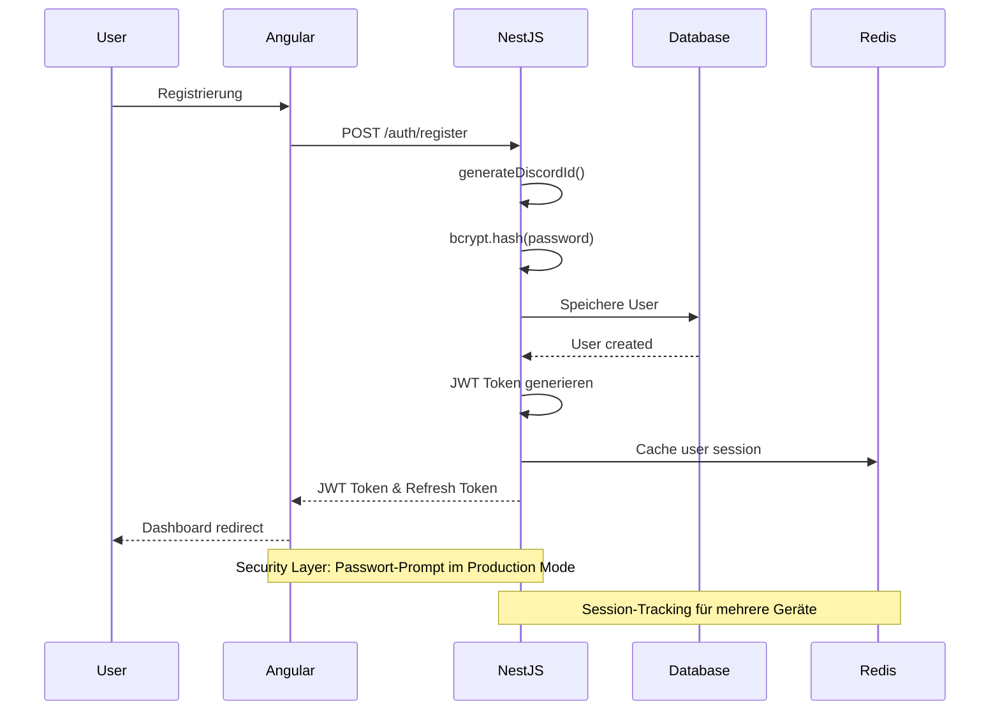
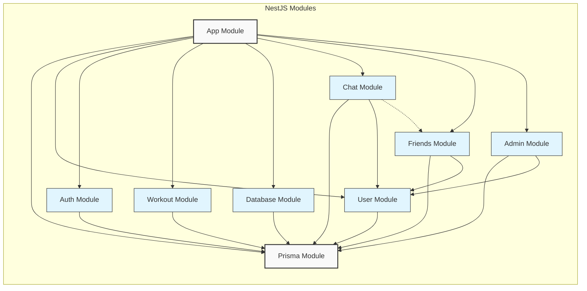
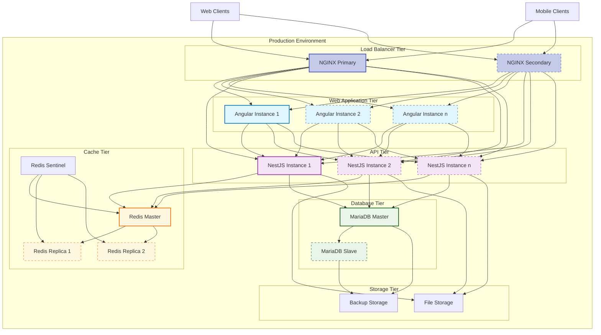
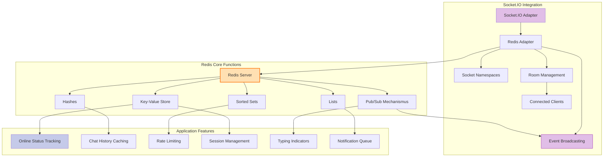
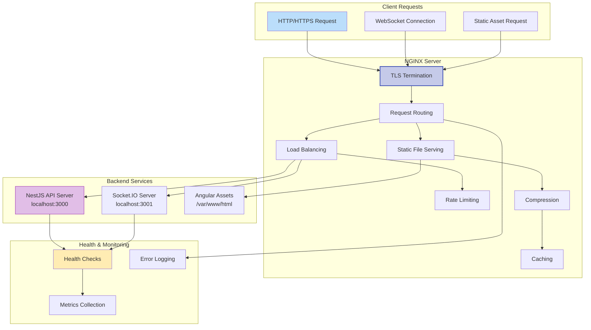

# 🏗️ DiscordGym - System Architektur

## 📊 Erweiterte Systemarchitektur



## 📊 Systemscale Architektur mit NGINX und Redis



## 🔐 Authentifizierung Flow



## 🗂️ Module Struktur



## 🚀 Deployment und Skalierung mit NGINX und Redis



## 📋 NGINX und Redis Konfigurationsdetails

### NGINX Konfiguration

```nginx
# Hauptkonfiguration für DiscordGym
http {
    # Upstreams für Load Balancing
    upstream nestjs_api {
        least_conn;
        server api1.internal:3000 max_fails=3 fail_timeout=30s;
        server api2.internal:3000 max_fails=3 fail_timeout=30s;
        server api3.internal:3000 max_fails=3 fail_timeout=30s;
    }
    
    upstream socketio_servers {
        ip_hash; # Sticky Sessions für WebSockets
        server socket1.internal:3001;
        server socket2.internal:3001;
    }
    
    # GZIP Kompression
    gzip on;
    gzip_types text/plain text/css application/json application/javascript;
    
    # Rate Limiting
    limit_req_zone $binary_remote_addr zone=api_limit:10m rate=10r/s;
    
    # SSL Konfiguration
    ssl_protocols TLSv1.2 TLSv1.3;
    ssl_prefer_server_ciphers on;
    ssl_session_cache shared:SSL:10m;
    
    # API Server Konfiguration
    server {
        listen 443 ssl http2;
        server_name api.discordgym.com;
        
        # SSL Zertifikate
        ssl_certificate /etc/nginx/ssl/discordgym.crt;
        ssl_certificate_key /etc/nginx/ssl/discordgym.key;
        
        # API Proxy
        location /api/ {
            limit_req zone=api_limit burst=20 nodelay;
            proxy_pass http://nestjs_api;
            proxy_set_header Host $host;
            proxy_set_header X-Real-IP $remote_addr;
        }
        
        # WebSocket Proxy
        location /socket.io/ {
            proxy_pass http://socketio_servers;
            proxy_http_version 1.1;
            proxy_set_header Upgrade $http_upgrade;
            proxy_set_header Connection "upgrade";
        }
    }
    
    # Frontend Server Konfiguration
    server {
        listen 443 ssl http2;
        server_name app.discordgym.com;
        
        ssl_certificate /etc/nginx/ssl/discordgym.crt;
        ssl_certificate_key /etc/nginx/ssl/discordgym.key;
        
        root /var/www/discordgym/public;
        
        # Statische Assets mit Caching
        location ~* \.(js|css|png|jpg|jpeg|gif|ico|svg)$ {
            expires 30d;
            add_header Cache-Control "public, no-transform";
        }
        
        # SPA Routing
        location / {
            try_files $uri $uri/ /index.html;
        }
    }
}
```

### Redis Konfiguration

```javascript
// redis.config.ts
export const redisConfig = {
  host: process.env.REDIS_HOST || 'localhost',
  port: parseInt(process.env.REDIS_PORT || '6379'),
  password: process.env.REDIS_PASSWORD,
  
  // Cluster Konfiguration
  cluster: process.env.REDIS_CLUSTER === 'true',
  clusterNodes: process.env.REDIS_CLUSTER_NODES?.split(',') || [],
  
  // Sentinel Konfiguration für Hochverfügbarkeit
  sentinel: process.env.REDIS_SENTINEL === 'true',
  sentinelName: process.env.REDIS_SENTINEL_NAME || 'mymaster',
  sentinels: process.env.REDIS_SENTINELS 
    ? JSON.parse(process.env.REDIS_SENTINELS) 
    : [{ host: 'localhost', port: 26379 }],
    
  // Weitere Optionen
  db: parseInt(process.env.REDIS_DB || '0'),
  keyPrefix: 'discordgym:',
  
  // Socket.IO spezifische Einstellungen
  pubClient: null, // Wird zur Laufzeit initialisiert
  subClient: null, // Wird zur Laufzeit initialisiert
};

// socket.adapter.ts
import { IoAdapter } from '@nestjs/platform-socket.io';
import { createAdapter } from '@socket.io/redis-adapter';
import { createClient } from 'redis';
import { ServerOptions } from 'socket.io';
import { redisConfig } from './redis.config';

export class RedisIoAdapter extends IoAdapter {
  private adapterConstructor: ReturnType<typeof createAdapter>;

  async connectToRedis(): Promise<void> {
    const pubClient = createClient({
      url: `redis://${redisConfig.host}:${redisConfig.port}`,
      password: redisConfig.password,
    });
    
    const subClient = pubClient.duplicate();
    
    await Promise.all([pubClient.connect(), subClient.connect()]);
    
    this.adapterConstructor = createAdapter(pubClient, subClient);
  }

  createIOServer(port: number, options?: ServerOptions): any {
    const server = super.createIOServer(port, options);
    server.adapter(this.adapterConstructor);
    return server;
  }
}
```

## � Redis Integration und Funktionen



## 🌐 NGINX Konfiguration und Routing



## �📁 Folder Struktur

```mermaid
graph TD
    Root[DiscordGym/]
    Root --> Client[client/]
    Root --> Server[server/]
    Root --> Docs[*.md Docs]
    Root --> Docker[Docker Files]
    Root --> GitHub[.github/]
    Root --> Nginx[nginx/]
    
    Client --> Angular[Angular 20 App]
    Client --> Pages[pages/]
    Client --> Services[shared/services/]
    Client --> Environments[environments/]
    
    Server --> NestJS[NestJS Backend]
    Server --> Prisma[prisma/]
    Server --> SrcModules[src/modules/]
    Server --> Utils[src/utils/]
    Server --> Config[src/config/]
    Server --> Redis[redis/]
    
    Redis --> RedisConfig[redis.config.ts]
    Redis --> Adapters[socket.adapter.ts]
    Redis --> Services[redis.service.ts]
    
    Nginx --> NginxConf[nginx.conf]
    Nginx --> Sites[sites-available/]
    Nginx --> SSL[ssl/]
    
    Prisma --> Schema[schema.prisma]
    Prisma --> Migrations[migrations/]
    
    Docker --> Compose[docker-compose.prod.yml]
    Docker --> NginxDocker[nginx-docker-compose.yml]
    Docker --> RedisDocker[redis-docker-compose.yml]
    
    GitHub --> Workflows[workflows/]
    Workflows --> CICD[ci-cd.yml]
    
    Utils --> Security[password-prompt.ts]
    Utils --> Helpers[helpers/]
    
    SrcModules --> Auth[auth/]
    SrcModules --> User[user/]
    SrcModules --> Chat[chat/]
    SrcModules --> Friends[friends/]
    SrcModules --> Workout[workout/]
    SrcModules --> Admin[admin/]
    
    style Root fill:#fff2cc
    style Client fill:#e1f5fe
    style Server fill:#f3e5f5
    style Docker fill:#e8eaf6
    style GitHub fill:#ffecb3
    style Redis fill:#ffe0b2,stroke:#ff6f00,stroke-width:1px
    style Nginx fill:#c5cae9,stroke:#3f51b5,stroke-width:1px
```


