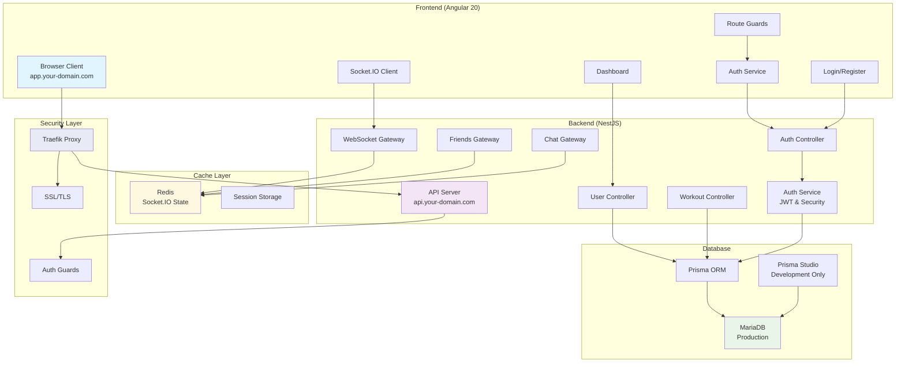
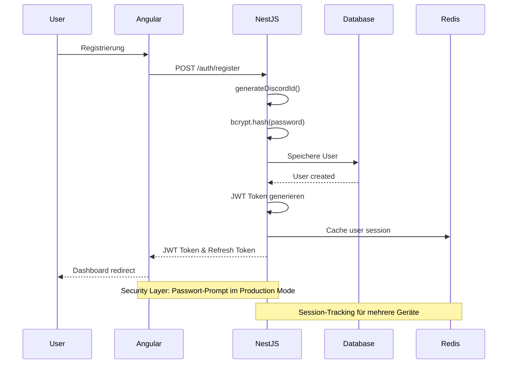
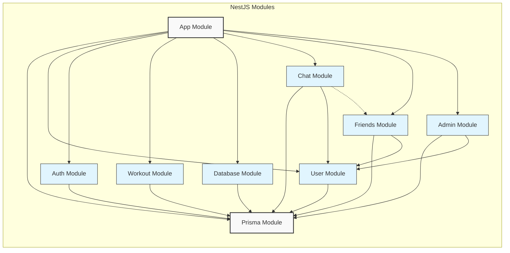

# 🏗️ DiscordGym - System Architektur

## 📊 Übersicht der Anwendungsarchitektur

```mermaid
graph TB
    subgraph "Frontend (Angular 20)"
        A[Browser Client<br/>app.your-domain.com]
        B[Auth Service]
        C[Dashboard]
        D[Login/Register]
        E[Route Guards]
        N[Socket.IO Client]
    end
    
    subgraph "Backend (NestJS)"
        F[API Server<br/>api.your-domain.com]
        G[Auth Controller]
        H[User Controller]
        I[Workout Controller]
        J[Auth Service<br/>JWT & Security]
        O[WebSocket Gateway]
        P[Friends Gateway]
        Q[Chat Gateway]
    end
    
    subgraph "Cache Layer"
        R[Redis<br/>Socket.IO State]
        S[Session Storage]
    end
    
    subgraph "Database"
        K[MariaDB<br/>Production]
        L[Prisma ORM]
        M[Prisma Studio<br/>Development Only]
    end

    subgraph "Security Layer"
        T[Traefik Proxy]
        U[SSL/TLS]
        V[Auth Guards]
    end
    
    A --> T
    T --> F
    B --> G
    C --> H
    D --> G
    E --> B
    G --> J
    H --> L
    I --> L
    J --> L
    N --> O
    O --> R
    P --> R
    Q --> R
    L --> K
    M --> K
    F --> V
    T --> U
    
    style A fill:#e1f5fe
    style F fill:#f3e5f5
    style K fill:#e8f5e8
    style R fill:#fff8e1
    style T fill:#e8eaf6
```

## 🔐 Authentifizierung Flow

```mermaid
sequenceDiagram
    participant User
    participant Angular
    participant NestJS
    participant Database
    participant Redis
    
    User->>Angular: Registrierung
    Angular->>NestJS: POST /auth/register
    NestJS->>NestJS: generateDiscordId()
    NestJS->>NestJS: bcrypt.hash(password)
    NestJS->>Database: Speichere User
    Database-->>NestJS: User created
    NestJS->>NestJS: JWT Token generieren
    NestJS->>Redis: Cache user session
    NestJS-->>Angular: JWT Token & Refresh Token
    Angular-->>User: Dashboard redirect
    
    Note over Angular,NestJS: Security Layer: Passwort-Prompt im Production Mode
    Note over NestJS,Redis: Session-Tracking für mehrere Geräte
```

## 🗂️ Module Struktur

```mermaid
graph LR
    subgraph "NestJS Modules"
        AM[App Module]
        PM[Prisma Module]
        UM[User Module]
        AUM[Auth Module]
        WM[Workout Module]
        DM[Database Module]
        CM[Chat Module]
        FM[Friends Module]
        ADM[Admin Module]
    end
    
    AM --> PM
    AM --> UM
    AM --> AUM
    AM --> WM
    AM --> DM
    AM --> CM
    AM --> FM
    AM --> ADM
    
    UM --> PM
    AUM --> PM
    WM --> PM
    DM --> PM
    CM --> PM
    FM --> PM
    ADM --> PM
    
    CM --> UM
    FM --> UM
    ADM --> UM
    
    CM -.-> FM
    
    classDef core fill:#f9f9f9,stroke:#333,stroke-width:2px
    classDef feature fill:#e1f5fe,stroke:#333,stroke-width:1px
    
    class AM,PM core
    class UM,AUM,WM,DM,CM,FM,ADM feature
```

## 📁 Folder Struktur

```mermaid
graph TD
    Root[DiscordGym/]
    Root --> Client[client/]
    Root --> Server[server/]
    Root --> Docs[*.md Docs]
    Root --> Docker[Docker Files]
    Root --> GitHub[.github/]
    
    Client --> Angular[Angular 20 App]
    Client --> Pages[pages/]
    Client --> Services[shared/services/]
    Client --> Environments[environments/]
    
    Server --> NestJS[NestJS Backend]
    Server --> Prisma[prisma/]
    Server --> SrcModules[src/modules/]
    Server --> Utils[src/utils/]
    Server --> Config[src/config/]
    
    Prisma --> Schema[schema.prisma]
    Prisma --> Migrations[migrations/]
    
    Docker --> Compose[docker-compose.prod.yml]
    Docker --> Traefik[traefik-docker-compose.yml]
    
    GitHub --> Workflows[workflows/]
    Workflows --> CICD[ci-cd.yml]
    
    Utils --> Security[password-prompt.ts]
    Utils --> Helpers[helpers/]
    
    SrcModules --> Auth[auth/]
    SrcModules --> User[user/]
    SrcModules --> Chat[chat/]
    SrcModules --> Friends[friends/]
    SrcModules --> Workout[workout/]
    SrcModules --> Admin[admin/]
    
    style Root fill:#fff2cc
    style Client fill:#e1f5fe
    style Server fill:#f3e5f5
    style Docker fill:#e8eaf6
    style GitHub fill:#ffecb3
```
