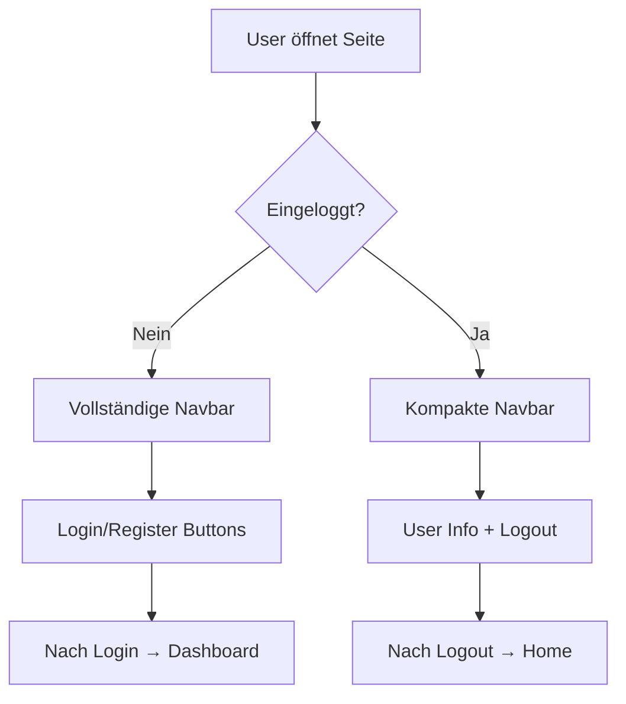

# 🎯 Conditional Navbar Implementation - DiscordGym

## 📋 **Überblick**

Das Navbar-System wurde erfolgreich so modifiziert, dass es **automatisch zwischen eingeloggten und nicht-eingeloggten Benutzern unterscheidet**.

---

## 🔧 **Was wurde implementiert**

### **1. Conditional Display Logic**
- **Nicht eingeloggt**: Vollständige Navbar mit Navigation, Login, Register und Discord-Buttons
- **Eingeloggt**: Kompakte Navbar mit nur Logo, Benutzername, Rolle und Logout-Button

### **2. Template Structure** 
```html
<!-- Public Navbar - Nur für nicht eingeloggte User -->
<nav *ngIf="!isLoggedIn" class="...">
  <!-- Vollständige Navigation mit Auth-Buttons -->
</nav>

<!-- Authenticated User Navbar - Kompakte Version -->
<nav *ngIf="isLoggedIn" class="...">
  <!-- Minimale Navigation mit User-Info -->
</nav>
```

### **3. Component Updates**
**navbar.ts:**
- ✅ `isLoggedIn` getter für AuthService.isLoggedIn() 
- ✅ `currentUser` getter für AuthService.getCurrentUser()
- ✅ Korrekte Imports und Methoden

**auth.service.ts:**
- ✅ User Interface erweitert um `role` und `isActive` Properties
- ✅ Kompatibel mit Backend UserRole Enum

---

## 🎨 **UI/UX Verbesserungen**

### **Für nicht-eingeloggte User:**
- **Höhe**: 64px (h-16) - Vollständige Navigation
- **Inhalt**: Home, Features, Pricing, About + Auth-Buttons
- **Mobile**: Hamburger-Menü mit vollständiger Navigation

### **Für eingeloggte User:**
- **Höhe**: 56px (h-14) - Kompakter Header  
- **Inhalt**: Logo → Dashboard + User-Info (Username, Rolle, Logout)
- **Rolle**: Farbkodierte Rolle-Badge (Purple für bessere Sichtbarkeit)

---

## 🧪 **Testing**

### **Testschritte:**
1. **🌐 Öffne** `http://localhost:4200`
2. **👀 Verifiziere** vollständige Navbar (nicht eingeloggt)
3. **🔐 Logge ein** mit Testuser (z.B. admin@discordgym.com / password123)
4. **✅ Bestätige** kompakte Navbar mit User-Info
5. **🚪 Teste** Logout-Funktionalität

### **Erwartetes Verhalten:**
- ✅ Navbar verschwindet bei Login (wie gewünscht)
- ✅ Kompakte User-Info bleibt für schnellen Zugriff
- ✅ Logo verlinkt zu Dashboard für eingeloggte User
- ✅ Mobile Responsive Design bleibt erhalten

---

## 🔗 **Navigation Flow**



---

## 🎭 **User Experience**

### **Vorher:**
- Navbar war immer sichtbar (redundant für eingeloggte User)
- Dashboard hatte eigene Navigation + externe Navbar

### **Nachher:**
- **Nicht eingeloggt**: Marketing-fokussierte Navigation
- **Eingeloggt**: Minimale, funktionale Top-Bar
- Dashboard kann eigene Navigation ohne Konflikt nutzen

---

## 📊 **Technical Details**

### **AuthService Integration:**
```typescript
get isLoggedIn(): boolean {
  return this.authService.isLoggedIn(); // ✅ Korrekte Methode
}

get currentUser() {
  return this.authService.getCurrentUser(); // ✅ Mit Role Support
}
```

### **User Interface:**
```typescript
export interface User {
  id: string;
  username: string;
  email: string;
  discordId: string;
  avatar: string;
  role?: string;        // ✅ NEU: Role Display
  isActive?: boolean;   // ✅ NEU: Status Tracking
  createdAt: string;
}
```

---

## 🎉 **Resultat**

✅ **Conditional Navbar** erfolgreich implementiert  
✅ **Authentication-aware** UI Logic  
✅ **Mobile responsive** Design  
✅ **Role-based** User Information  
✅ **Clean separation** zwischen Public/Auth States  

**Das System ist bereit für den Chat-Fokus und bietet eine optimale UX für beide User-States!**
