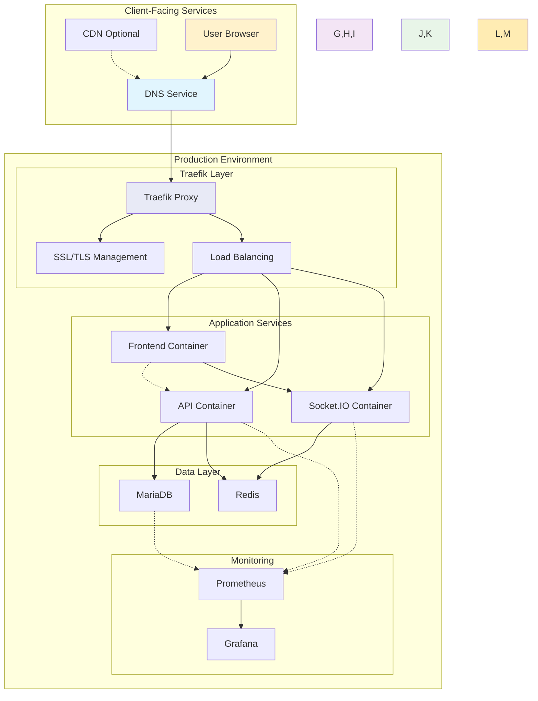
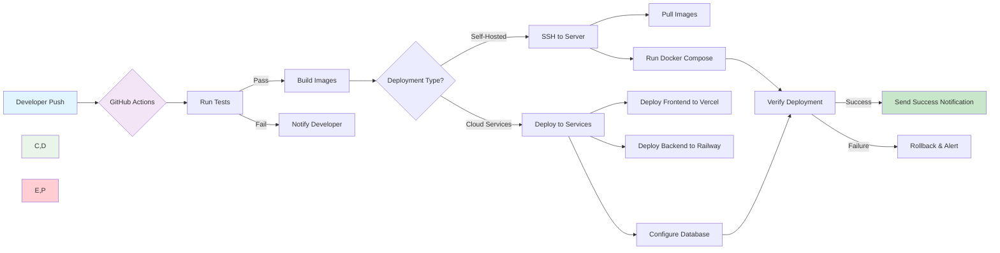
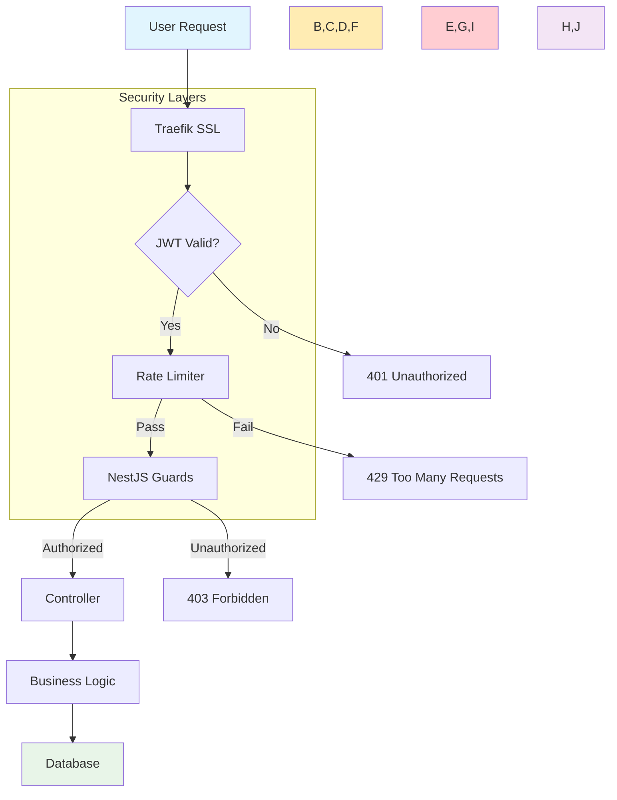
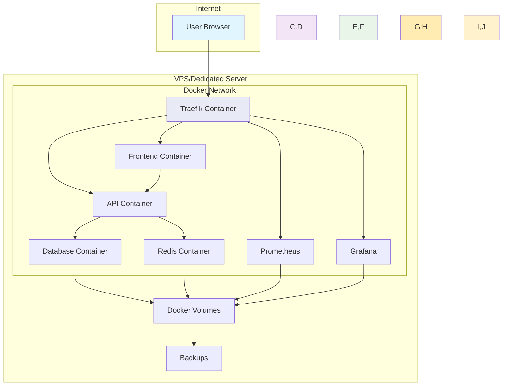
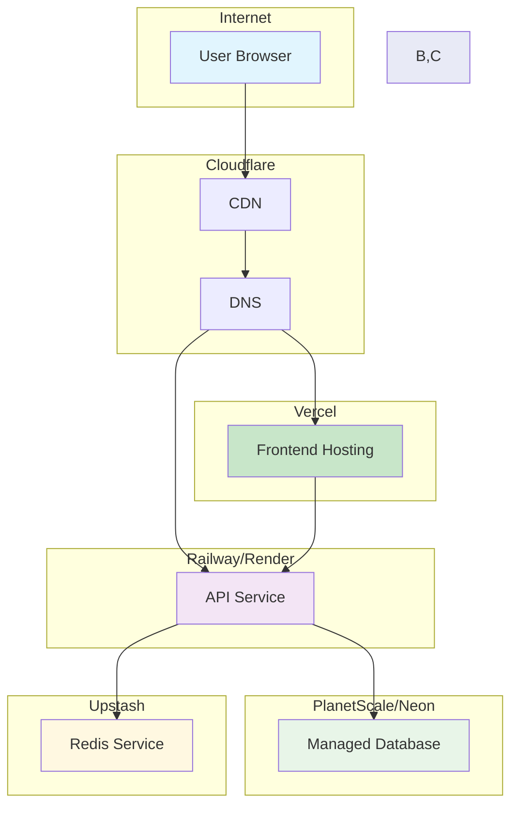

## 🌐 Deployment Architecture

## 🔄 CI/CD Pipeline Workflow

## 🔒 Security Architecture

## 🌟 Produktionsumgebung (Option A: Selbst-Hosting)

## 🌟 Produktionsumgebung (Option B: Cloud Services)

